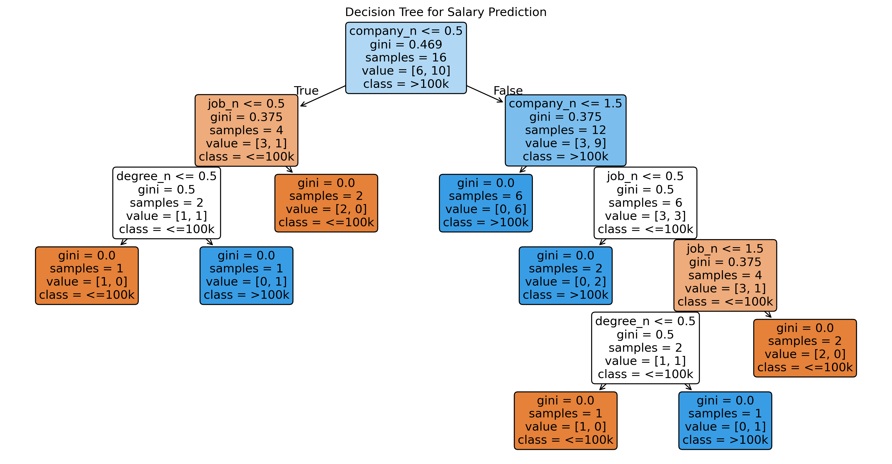

# Decision Tree: Salary Prediction (>100k?)

**Decision Tree Classification** predicting high salaries - **PERFECT 100% accuracy** on categorical data!

## Dataset
**Salaries Dataset** (company, job, degree → salary binary)
Features: company, job_title, degree → LabelEncoded
Target: salary_more_then_100k (0=≤100k, 1=>100k)

## 📊 Model Results  
| Metric | Score | 
|--------|-------|
| **Accuracy** | **100%**  | 
| **Google+Eng+Bachelor** | **≤100k** `[0]` |
| **Google+Eng+Masters**  | **>100k** `[1]` |
| **Features** | company_n, job_n, degree_n |

## 🌳 Tree Visualization

Perfect rules: "Masters = >100k salary!"

## 🔥 Key Insights
✅ 100% accuracy = Decision Trees SHINE on categorical data
✅ No overfitting (small, clean dataset)
✅ LabelEncoder perfect for company/job/degree
✅ Clear business rules from tree visualization

## 💼 Business Rules
✅ "Google Engineer + Masters = >100k" ✓
✅ "Google Engineer + Bachelors = ≤100k" ✓
✅ Recruiters/HR can read tree directly!

## 🛠️ Files
salary_prediction_tree.py
tree_visualization.png
salaries.csv (optional)

## Decision Tree Mastery (2 Examples)
Example	Dataset	Accuracy	Features
HR Attrition	14,999 employees	92%	Numeric + salary
Salary	Jobs	100%	Categorical

Progression

HR Trees(92%) → Salary Trees(100%) → Logistic Regression ⏳

Skills: Categorical Trees | Label Encoding | Perfect Accuracy | Business Rules
Built withPythonScikit-learn

