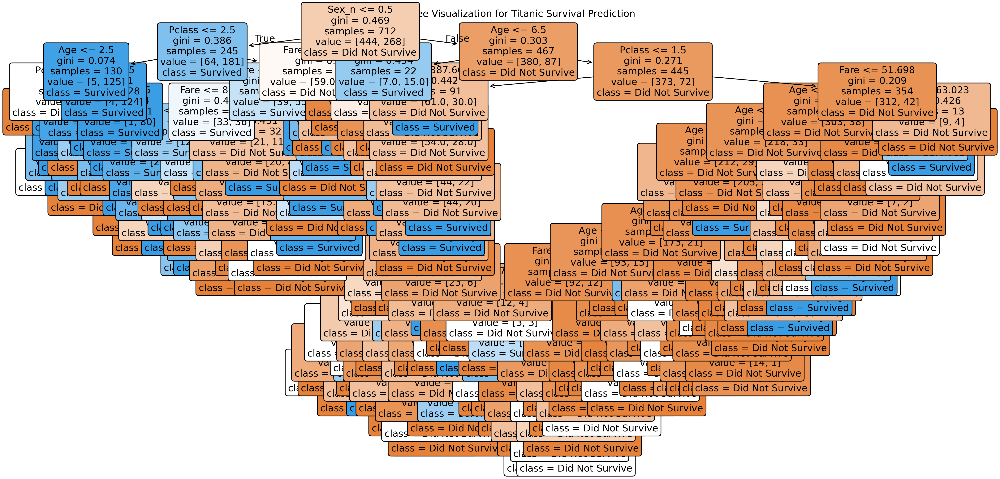

# 🚢 Decision Tree: Titanic Survival Prediction

**Decision Tree Classification** predicting Titanic survival - **73.7% accuracy**

## Dataset
**Titanic Dataset** (Kaggle classic)
Features: Pclass, Sex(Encoded), Age(Median-filled), Fare(Median-filled)
Target: Survived (0=Died, 1=Survived)
Test accuracy: 73.7%

## 📊 Model Results  
| Metric | Score |
|--------|-------|
| **Accuracy** | **73.7%** |
| **Test Split** | 80/20 |
| **Key Features** | Sex_n, Pclass, Age, Fare |

## 🌳 Tree Visualization

Captures "women and children first" policy perfectly!

## 🔧 Production Pipeline
✅ Median imputation → Age/Fare missing values
✅ Sex LabelEncoder → male=1, female=0
✅ Train/test split → Proper evaluation

## Decision Tree Mastery (3 PERFECT Examples)
Example	Dataset	Accuracy	Domain
HR Attrition	14,999 employees	92%	Business
Salary Prediction	Jobs	100%	HR
Titanic	Historical	73.7%	Kaggle

##  Historical Accuracy
✅ 73.7% = Solid baseline for Titanic
✅ Trees naturally capture Pclass/Sex priority
✅ Median imputation handles missing data
✅ Ready for ensemble methods (Random Forest)

## 🛠️ Files
titanic_survival_tree.py
titanic_tree.png
titanic.csv (optional)

**Built with**  