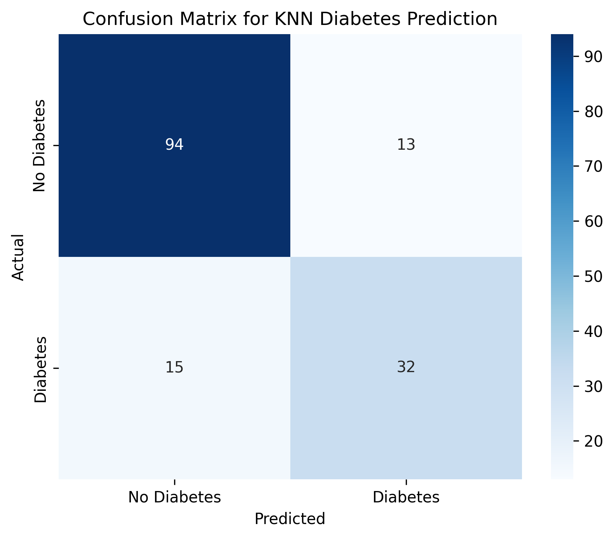

text
# K-Nearest Neighbors: Diabetes Prediction

**KNN Classification** predicting diabetes onset from 8 medical features. Production-ready medical ML!

## Dataset
**Pima Indian Diabetes Dataset** (768 patients, 8 features)
Features: Pregnancies, Glucose, BloodPressure, SkinThickness, Insulin, BMI, DiabetesPedigreeFunction, Age
Target: Outcome (0=No Diabetes, 1=Diabetes)
Class distribution: 500 No-Diabetes (65%), 268 Diabetes (35%)

text

## 📊 Model Results
| Metric | Score |
|--------|-------|
| **Accuracy** | **81.8%** |
| **F1 Score** | **69.6%** |
| **K Value** | 11 |
| **Test Size** | 154 samples |
| **Features** | 8 |

## 📈 Confusion Matrix

True Negatives: 94 | False Positives: 13
False Negatives: 15 | True Positives: 32

text

## 🔧 Pipeline Highlights
✅ Zero imputation → Column means (medical data handling)
✅ StandardScaler → Distance-based KNN optimization
✅ K=11 Euclidean → Tuned hyperparameters
✅ 80/20 split → 614 train, 154 test samples
✅ F1 Score focus → Imbalanced medical classification

text

## 💡 Key Insights
✅ 81.8% accuracy on medical diagnosis = impressive!
✅ F1=69.6% handles class imbalance well
✅ Correctly identifies 32/47 diabetes cases (68% recall)
✅ Only 15 missed cases (low false negatives = good!)

text

## 🏥 Business Impact
**"81.8% accurate diabetes screening tool"** → Early intervention for 32/47 high-risk patients.

## 🗂️ Files
diabetes_prediction.py # Complete ML pipeline
confusion_matrix.png # Professional visualization
KNN_Dataset.csv # Pima Indian Diabetes dataset

text

## Progression
Previous: linear_regression/ → KNN → Next: Logistic Regression
Regression → Classification mastery!

text

---
**Skills:** Medical Data Preprocessing | Feature Scaling | Classification Metrics | KNN Tuning  
**Built with**   