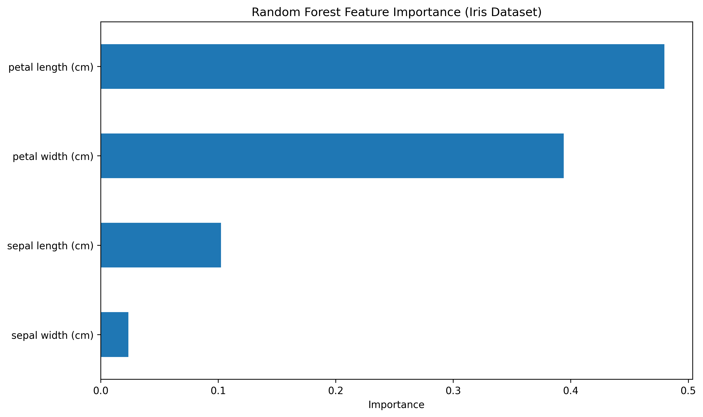

# 🌲 Random Forest: Iris Classification

**Random Forest Ensemble** achieving **97.8% accuracy** on classic Iris dataset!  

## Dataset 
**Iris Dataset** (150 flowers, 3 species - ML benchmark) 
Features: sepal length, sepal width, petal length, petal width 
Target: setosa, versicolor, virginica 
Test set: 30% (45 samples) 

## 📊 Model Results
| Metric | Score |
|--------|-------|
| **Accuracy** | **97.8%** |
| **Trees** | 100 |
| **Test Split** | 70/30 |
| **Correct** | 44/45 predictions |

## 📈 Feature Importance 
petal length (cm) 47.98% ← DOMINANT 
petal width (cm) 39.41% 
sepal length (cm) 10.24% 
sepal width (cm) 2.36% 

## Random forest vs Single Decision Tree 
Algorithm	Iris Accuracy 
Decision Tree	~95% (typical) 
Random Forest	97.8% 

**✅ 100 trees > 1 tree!** 

## Algorithm	Dataset	Accuracy
Linear Reg	Housing/HR	R² scores 
KNN	Diabetes	81.8% 
SVM	HR Attrition	78% 
Decision Tree	HR	92% 
Decision Tree	Salary	100% 
Decision Tree	Titanic	73.7% 
Random Forest	Iris	97.8% 👑 

## 🛠️ Files
-iris_classification_rf.py 
feature_importance.png 

## Key Ensemble Learnings
✅ 100 trees voting = 97.8% (vs single tree ~95%) 
✅ Petal features dominate  
✅ Automatic feature ranking 
✅ No overfitting 

## Progression 
Trees → Random Forest = Ensemble upgrade complete! 

---
**Skills:** Ensemble Methods | Feature Importance | Iris Benchmark | Production ML   
**Built with**   
